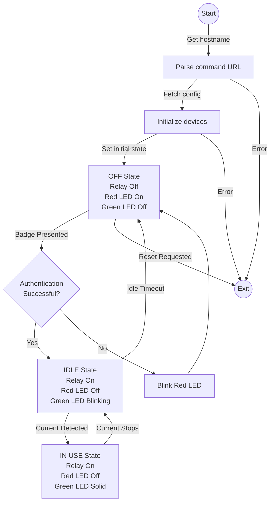

A simple, reliable Go automation for makerspace authboxes.

### Features

* Reads its config remotely by HTTP fetching a JSON blob.
* Badge reading with remote authentication. Automatic renewal.
* Power sensing with idle timeout.
* Green & red LED management for interaction feedback.
* MQTT config & state publishing compatible with Home Assistant MQTT integration.
* On-demand self-reset by subscribing to a "reset" MQTT topic.
* Basic logging.

### State machine



### Config server

[`authbox_config.go`](cmd/config/authbox_config.go) is a lightweight server for the per-authbox JSON config.
It reads from a main config file which describes the base (shared) config, the list of available authboxes and per-authbox overrides.

The base config file must follow a schema similar to the following:

```jsonc
{
    // List of authboxes to send a config for.
    "authboxes": {
        "pantorouter": {            // Hostname
            "name": "Pantorouter",  // API name
            "location": "zrh",      // API location
            "api_key": "abc",       // API key
            "custom": {             // Optional overrides to the below config.
                "idle_duration_s": 30
            }
        },
        "jointerplaner": {
            "name": "Jointer-planer",
            "location": "zrh",
            "api_key": "xyz"
        }
    },
    // Default config served to all authboxes.
    "config": {
        "badge_reader": {
            "name": "HID OMNIKEY 5427 CK",
            "timeout_ms": 200
        },
        "badge_auth": {
            // {{.x}} variables are replaced by the above values for the
            // requesting host. The template will then further be interpreted by
            // the authbox with context `badge`, `state`, and `duration`, which
            // therefore needs to be escaped here.
            "url_template": "http://control.shop:8000/auth?tool={{.tool}}&name={{.name}}&api_key={{.api_key}}&badge={{`{{.badge}}`}}&action={{`{{.state}}`}}&minutes={{`{{.duration}}`}}",
            "usage_duration_minutes": 10
        },
        "relay": {
            "pin": 21,
            "active_low": true,
            "debounce_ms": 25
        },
        "current_sensing": {
            "pin": 23,
            "active_low": true,
            "debounce_ms": 200
        },
        "green_led": {
            "pin": 26
        },
        "red_led": {
            "pin": 20
        },
        "mqtt": {
            "broker": "mqtt://control.shop:1883",
            "topic": "shop"
        },
        "idle_duration_s": 5
    }
}
```