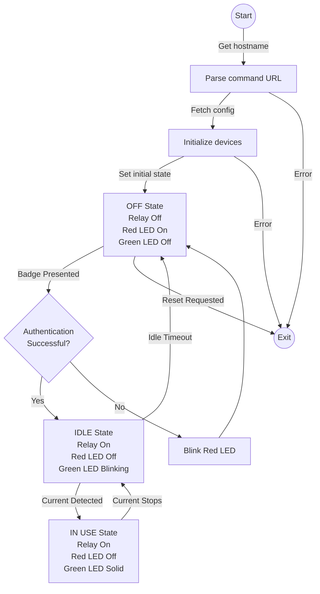

A simple, reliable Go automation for makerspace authboxes.

### Features

* Reads its config remotely by HTTP fetching a JSON blob.
* Badge reading with remote authentication. Automatic renewal.
* Power sensing with idle timeout.
* Green & red LED management for interaction feedback.
* MQTT config & state publishing compatible with Home Assistant MQTT integration.
* On-demand self-reset by subscribing to a "reset" MQTT topic.
* Basic logging.

### State machine


```mermaid
flowchart TD
    START((Start)) -->|"Get hostname"| INIT1[Parse command URL]
    INIT1 -->|"Fetch config"| INIT2[Initialize devices]
    INIT2 -->|"Set initial state"| OFF[OFF State<br/>Relay Off<br/>Red LED On<br/>Green LED Off]
    
    OFF -->|Badge Presented| AUTH{Authentication<br/>Successful?}
    
    AUTH -->|Yes| IDLE[IDLE State<br/>Relay On<br/>Red LED Off<br/>Green LED Blinking]
    AUTH -->|No| DENY[Blink Red LED]
    DENY --> OFF
    
    IDLE -->|Current Detected| INUSE[IN USE State<br/>Relay On<br/>Red LED Off<br/>Green LED Solid]
    IDLE -->|Idle Timeout| OFF
    
    INUSE -->|Current Stops| IDLE

    %% Reset handling
    OFF -->|"Reset Requested"| END((Exit))
    
    %% Error conditions from initialization
    INIT1 -->|"Error"| END
    INIT2 -->|"Error"| END
```

### Config server

[`authbox_config.go`](cmd/config/authbox_config.go) is a lightweight server for serving per-authbox configuration.
The server evaluates a **Jsonnet** configuration file on startup.

An example `config.jsonnet` configuration looks like this:

```jsonnet
local base = {
  mqtt: {
    broker: "tcp://control.shop:1883",
    topic: "shop",
  },
  badge_reader: {
    name: "HID OMNIKEY 5427 CK",
    timeout_ms: 200,
  },
  badge_auth: {
    // Go's text/template syntax is used to dynamically construct the URL.
    // The keys {{.tool}}, {{.apiKey}}, {{.name}}, and {{.location}} are auto-resolved by the config server.
    // Use {{`{{.badgeId}}`}}, {{`{{.state}}`}}, and {{`{{.duration}}`}} to escape variables meant for client evaluation.
    url_template: "http://control.shop:8000/auth?tool={{.tool}}&name={{.name}}&api_key={{.apiKey}}&badge={{`{{.badgeId}}`}}&action={{`{{.state}}`}}&minutes={{`{{.duration}}`}}",
    usage_duration_minutes: 10,
  },
  relay: {
    pin: 21,
    active_low: true,
    debounce_ms: 25,
  },
  current_sensing: {
    pin: 23,
    active_low: true,
    debounce_ms: 200,
  },
  green_led: { pin: 26 },
  red_led: { pin: 20 },
  idle_duration_s: 5,
};

local api(key, name) = { api_key: key, name: name, location: "zrh" };

{
  "pantorouter": base + api("abc", "Pantorouter") + { idle_duration_s: 30 },
  "jointerplaner": base + api("xyz", "Jointer-planer"),
}
```
